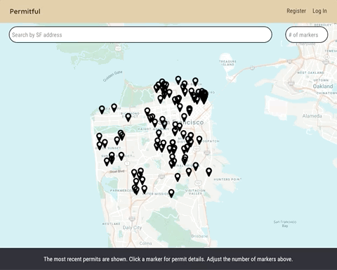

# Permitful

Permitful provides an interactive map that allows users to visualize where all of the most recently updated building permits in a specific jurisdiction are located. San Francisco is the first supported jurisdiction.

## Live App

See a live version of this app here: [permitful.com](https://permitful.com/).

## Permitful Server

View the server side code in this [GitHub repo](https://github.com/gavinmgrant/permitful-api).

## User Flow

Once at the permit map, users may type in an address and find all building permits available for that property, if any.

## Available Scripts

In the project directory, you can run:

### `npm start`

Runs the app in the development mode. 
Open [http://localhost:3000](http://localhost:3000) to view it in the browser.

The page will reload if you make edits. 
You will also see any lint errors in the console.

### `npm test`

Launches the test runner in the interactive watch mode. 
See the section about [running tests](https://facebook.github.io/create-react-app/docs/running-tests) for more information.

### `npm run build`

Builds the app for production to the `build` folder. 
It correctly bundles React in production mode and optimizes the build for the best performance.

The build is minified and the filenames include the hashes. 
Your app is ready to be deployed!

See the section about [deployment](https://facebook.github.io/create-react-app/docs/deployment) for more information.