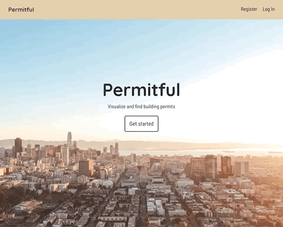

# Permitful

Permitful provides an interactive map that allows users to visualize where all of the most recently updated building permits in a specific jurisdiction are located. San Francisco is the first supported jurisdiction.

* Users can search for an address and find any building permit on file for that property.
* Once your search finds a property, Permitful lists any building permits on file. For each permit, you will find its permit number, status, and a brief description.
* Registered users can select their favorite permits and quickly retrieve their details later. Save time and register.

## Live App

See a live version of this app here: [permitful.com](https://permitful.com/).

## Permitful Server

View the server side code in this [GitHub repo](https://github.com/gavinmgrant/permitful-api).

## User Flow

Users arrive on a landing page that lists the main features of the app.

Users click the "get started" button to go to the permit map where they see the latest building permits in the city and can click the markers to see the permit's details.

Users may search for an address and find all building permits available for that property, if any.

Users interested in seeing the latest permits and patterns of development can incrementally increase the marker count.

Registered users can log in to access a list of favorite permits and add more favorites to their list.

## Available Scripts

In the project directory, you can run:

### `npm start`

Runs the app in the development mode. 
Open [http://localhost:3000](http://localhost:3000) to view it in the browser.

The page will reload if you make edits. 
You will also see any lint errors in the console.

### `npm test`

Launches the test runner in the interactive watch mode. 
See the section about [running tests](https://facebook.github.io/create-react-app/docs/running-tests) for more information.

### `npm run build`

Builds the app for production to the `build` folder. 
It correctly bundles React in production mode and optimizes the build for the best performance.

The build is minified and the filenames include the hashes. 
Your app is ready to be deployed!

See the section about [deployment](https://facebook.github.io/create-react-app/docs/deployment) for more information.